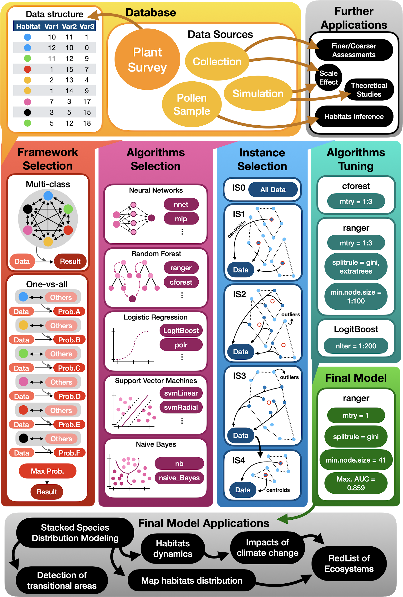

```{r Inicialização Info, message=FALSE, warning=FALSE, include=FALSE, paged.print=TRUE}
knitr::opts_chunk$set(echo = F, message=F, warning=F)
options(scipen = 999, digits = 3)

source(file="../scripts/Generalized_Classification_Function.R")
```

# {.tabset .tabset-fade}

## Authors 

```{r message=FALSE, warning=FALSE, include=FALSE, paged.print=TRUE}
knitr::opts_chunk$set(echo = F, message=F, warning=F)

library(here)
library(tidyverse)
library(htmltools)
library(hrbrthemes)
library(sjmisc)
library(pander)

breve_descricao <- ""

membros <- list(
    luiz <- list(
        nome ="Luíz Fernando Esser",
        email = "luizesser@gmail.com",
        foto = "./assets/authors/luiz.jpg",
        tamanho_foto = "80%",
        afiliacao = "Universidade Federal do Rio Grande do Sul",
        afiliacao_link = "http://www.ufrgs.br/",
        afiliacao_abrev = "Departamento de Botânica",
        papel = ""
    ),
    reginaldo <- list(
        nome ="Reginaldo Ré",
        email = "reginaldo@utfpr.edu.br",
        foto = "./assets/authors/reginaldo.jpg",
        tamanho_foto = "69%",
        afiliacao = "Universidade Tecnológica Federal do Paraná",
        afiliacao_link = "http://www.utfpr.edu.br/cursos/coordenacoes/stricto-sensu/ppgcc-cm/area-academica/docentes/reginaldo-re",
        afiliacao_abrev = "Departamento de Computação",
        papel = ""
    ),
    vincent <- list(
        nome ="Vincent Montade",
        email = "vincent.montade@gmail.com",
        foto = "./assets/authors/vincent.webp",
        tamanho_foto = "76%",
        afiliacao = "Université de Montpellier",
        afiliacao_link = "https://isem-evolution.fr/en/membre/montade/",
        afiliacao_abrev = "The Institute of Evolutionary Science of Montpellier",
        papel = ""  
    ),
    danilo <- list(
        nome ="Danilo Rafael Mesquita Neves",
        email = "dneves@icb.ufmg.br",
        foto = "./assets/authors/danilo.png",
        tamanho_foto = "80%",
        afiliacao = "Universidade Federal de Minas Gerais",
        afiliacao_link = "https://ufmg.br/",
        afiliacao_abrev = "Instituto de Ciências Biológicas",
        papel = ""  
    )
)
```


```{r echo=FALSE}
tag_container <- tags$div(class="container")

tag_heading <- tags$div(
    class = "heading-title text-center",
    tags$h3(class = "text-uppercase", ""),
    tags$p(class = "p-top-30 half-txt", breve_descricao)
) 

lista_rows <- list() 
for (i in 1:ceiling(length(membros)/4)){
    lista_html_membros <- list()
    
    for (j in 1:4) {
        if (j+((i-1)*4) > length(membros)){
            break();
        }
        membro <- membros[[j+((i-1)*4)]]
        lista_html_membros <- lista_html_membros %>% 
            c(list(
                tags$div(class = "col-md-3 col-sm-3",
                    tags$div(class = "team-member",
                         tags$div(class = "team-img",
                            tags$img(
                                 src = membro$foto,
                                 alt = "team member",
                                 class = "img-responsive",
                                 style = paste0(
                                     "margin:auto;top: 0; left:0; right:0; bottom:0;display: block; width:",
                                     membro$tamanho_foto
                                 )
                            )
                         ),
                        tags$div(class = "team-hover",
                            tags$div(class = "desk",
                                tags$h4(membro$afiliacao),
                                tags$p(membro$papel)),
                            tags$div(class = "s-link",
                                tags$a(membro$afiliacao_abrev, href = membro$afiliacao_link)
                            )
                        ),
                    ),    
                    tags$div(class = "team-title",
                             tags$h5(membro$nome),
                             tags$p(membro$email)
                    )
                )
            ))
    }
    lista_rows <- lista_rows %>%
        c(list(tags$div(class="row",
                lista_html_membros
             )
        ))
}


html_doc <- tagAppendChild(
                tag_container, 
                tagAppendChild(tag_heading, 
                    tagAppendChild(tags$br(), list(tags$br(), tags$br(), lista_rows))
                )
            )

html_doc
```


### Authors Contributions  

DN and VM conceived the idea and reviewed the final manuscript; LFE and RR designed methodology. LFE analyzed the data and led the writing. All authors gave final approval for publication.

### Acknowledgements

This study was financed in part by the Coordenação de Aperfeiçoamento de Pessoal de Nível Superior - Brasil (CAPES) - Finance Code 001. LFE was supported by CAPES PhD scholarship.


### Data Availability
NTT dataset is fully available at http://neotroptree.info. R script is available in Supplementary. Model generated for the Atlantic Rainforest is available by request.


## Abstract {.tabset .tabset-fade}

1. Habitats mapping and detection is a key task in applied (e.g. biodiversity conservation) and theoretical (e.g. scale effects) studies.

2. We built a habitats classification framework using machine learning algorithms in R.

3. The model built with the framework could confidentially segregate the six habitats from Atlantic 4. Rainforest given the three most diverse tree families (AUC = 0.859).

4. Direct implications are the use to map habitats distributions, improving assessments from climate change impacts and RedList of Ecosystems. Indirect applications proposed are the use of the structure of the framework to determine pollen assemblages, bioregionalization assessments and scale effect studies.

*Keywords:* Atlantic Rainforest, machine learning, 

## Introduction {.tabset .tabset-fade}   

Long before the big-data era, naturalists and explorers traveling around the world, studied and wandered extensively through unexplored regions to understand differences between habitats (hereafter defined as plant assemblages and its associated environmental conditions). To know the flora and the distribution of abundant taxa through space was key to delimitate different physiognomies. Nowadays, community and ecosystem ecologists developed a myriad of different approaches to map habitats and improve knowledge about their mechanisms. One of these approaches is from Olson et al. (2001), where they mapped ecoregions, through overlap of different maps: from bioregions, landforms and vegetation to climate, fire disturbances and vertebrate migrations. The authors point out that ecoregions normally have habitats within, that differ from their assigned biome and that conservation planning for ecoregions must map those less dominant habitats. Their approach, although, is very broad, so they could map bioregions on a global scale. In another study, Tuomisto et al. (2019) crossed environmental, plant survey and remote sense data, which could be more efficient in time as others, but may be not practical depending on your scale resolution. Species distribution modeling (SDMs) is a widely used method to map habitats distribution, through macroecological modeling (MEM; e.g. Carnaval & Moritz, 2008) or stacked species distribution modeling (e.g. Esser, Neves, & Jarenkow, 2019). Nevertheless, approaches using SDMs are somewhat problematic to reproduce when they generate models for every woody species (e.g. Zhang, Slik, & Ma, 2016), since this is very time consuming and may overlook environmental relationships. On the other hand, modeling diagnostic species for each habitat (Esser et al., 2019) would solve that, but then ignores the space-environment continuum which nature is, once assigns different environmental variables for each habitat to be mapped. 

Given the problems that arise with different strategies to map and understand habitats, we hereby propose a machine learning approach for habitats detection in R using collectors data that can be applied at any scale, from global to local, allowing habitat mapping to be less time consuming and considering species turnover, which unveils transitional areas (Figure 1). In a former study (Neves et al., 2017), researchers found a possible evidence that the proportion of tree species in key families, could segregate habitats from a tropical forest. We present the final model built for Atlantic Rainforest biodiversity hotspot and a R script with full reproducibility to facilitate framework’s use, expansion, improvement and transferability. Providing these data, we argue that it could improve a variety of ecological assessments, from theoretical studies as scale effect, to applicable studies as conservation planning for climate change scenarios.


<div>

</div>
Figure 1: Framework overview. 


## Methods {.tabset .tabset-fade}

### Data base

Input data comprised a subset of NeoTropTree database, which is a database of tree species checklists along the neotropical region. Each site in NeoTropTree is classified according to Oliveira-Filho (2017), presenting a checklist of species within a 5 km radius buffer. Each site is classified in different habitats, and domains, with presence and absence information for each of the species. The subset used in this study comprised only data from Atlantic Rainforest. Habitats from within this domain were reclassified accordingly to Neves et al. (2017). As the database is built with species names, we determined each species family using Taxonstand package in R 3.6.2 (R Development Core Team, 2011; Cayuela, Cerda, Albuquerque, & Golicher, 2012), then summed all species within a family, resulting in a matrix with sites versus families, where each cell is the number of species within a family in a given site. For the purpose of this study we considered Myrtaceae, Fabaceae and Rubiaceae as predictors, which are three botanical families of widely importance in the study region, and with the highest number of species in NeoTropTree.

### Framework selection

We built two machine learning frameworks, ensembling five classification algorithms with different approaches through an area under the receiver operating characteristic curve (AUC) weighted vote system. The first framework uses a multi-class classification approach, which consists in training the algorithms to segregate between the six habitats from Atlantic Rainforest. The second, is a one-vs-all approach, which trains algorithms to segregate one habitat from the others. Methods for both frameworks were essentially the same to keep comparability. We started by dividing data into train (90%) and test (10%) data, maintaining proportions between habitats. This ensures that we will have a sample of each habitat in both train and test data, as well as retains an independent test data. As habitats have different numbers of records (class imbalance), we sampled records up, that is, we sampled all minor classes, with replacement, until all have the same number of records as the major class. This approach may raise AUC levels, when compared to a scaling down; but, as we do not have many records and this is standardized between frameworks (i.e. the effect will be applied equally in both), we choose to scale them up. We built models from five selected algorithms (Naive Bayes; Random Forest; Boosted Logistic Regression; Neural Network; Support Vector Machines with Radial Basis Function Kernel) with standard parameterization using the train data. Algorithm performance was obtained running 10 times a 10-fold cross-validation, where in each fold we calculated AUC values. Then, we projected the models into the test data and used AUC values to weight each algorithm result. The predicted habitat, given the test data, was that with the greatest number of weighted votes. The only difference between frameworks, relied essentially in the fact that the one-vs-all approach trained algorithms to segregate one habitat from all the others and then projected each of the six models generated (one for each habitat) into the test data, while the multi-class approach trained algorithms to segregate the six habitats from one another. We run frameworks 100 times, selecting a new train and test data at each run. Finally, we compared, using Welch's t-test, whether the approach that optimized AUC values was the multi-class or the one-vs-all. This approach was proposed so we could minimize algorithms effects. Framework selection was performed using caretEnsemble package (Deane-Mayer & Knowles, 2016) to run models and pROC package (Robin et al., 2011) to calculate multi-class AUC values.

### Algorithms Selection

Afterwards, we selected all classification algorithms, that accepted multi-class, non-binary and non-categorical predictors, available in caret package (Kuhn, 2008). Selected algorithms should also be classified as random forests, logistic regressions, neural networks, support vector machines or naive Bayes approaches. Using the 34 algorithms that we managed to implement (complete list available in Supplementary), we run our multi-class routine 100 times, but instead of making a weighted ensemble, we applied models from each algorithm in the test data and calculated AUC value. This allows us to compare each algorithm contribution to maximize evaluation metrics. The three algorithms with highest mean plus maximum AUC values were selected for the next steps.

### Instance Selection

We used four instance selection alternatives (a pre-processing method) to see which delivered the best results, when compared to not using (IS0), as in previous steps. Instance selection aims to supply the best training data for the algorithms. Alternatives presented are all based on clusterization and outliers removal. In the first approach (IS1), we generated 50 clusters to each habitat's train data using k-nearest neighbors and extracted clusters' centroids, which composed the training data. The second approach to instance selection (IS2) was to generate 50 clusters, as the first, and then exclude 50% of the farthest records from the centroid within its cluster (outliers); remaining records were used as training data. In the third approach (IS3), we calculated only one cluster for the whole habitat and then deleted 50% of the farthest records from the centroid and used the remaining records as training data. The fourth and last approach (IS4), consisted in removing outliers from one cluster, as the third approach, but then calculating 30 clusters with the remaining data and using the centroids from them as training data. The first and fourth approaches solved the imbalance problem we had when considering all data just by calculating the same amount of clusters for each habitat; thus, to sample up was not necessary in those cases. Apart from that, the framework applied in each approach from this section was the same from Algorithms Selection section. We choose not to use an ensemble approach (as in Framework Selection section), once at least one of the algorithms alone could better predict habitats than all together. To compare the four instance selection approaches, we run each of them 100 times, saving AUC values from test predictions and performing an analysis of variance. To evaluate pair means, we used Tukey test.

### Algorithms Tuning

Algorithms tuning was performed with Conditional Inference Random Forest (caret package code, and hereafter: cforest), Random Forest (caret package code, and hereafter: ranger) and Boosted Logistic Regression (caret package code, and hereafter: LogitBoost). We run the same multi-class framework from algorithm selection, but searching for an optimal range of values that could more frequently comprise the best tuning parameters (optimizing AUC values) for each of the algorithms. The following description comprises the beginning set of values for each parameter from each algorithm. The only parameter for cforest was the number of variables randomly sampled as candidates at each split (mtry), which was set to vary from one to three. An expanded grid (meaning, a data frame with all possible combinations between different vectors) was created for ranger tuning parameters, were the number of variables randomly sampled as candidates at each split (mtry) values ranged from one to three; the split rule varied between minimizing the Gini impurity and randomly selecting a split point (extratrees); and the minimum node size varying from one to 100. The only parameter from LogitBoost is the number of iterations, which was set to vary from one to 200. After running these models and visually analyzing results, we constricted tuning range, and rerun models. This followed until we kept just parameter ranges that consistently delivered good AUC performance, excluding those that only had poor performance. This step was crucial so we could optimize computational time. Final value from cforest’s mtry was one; from ranger, mtry was set to one, minimum node size varying from 25 to 35 and the split rule was not conclusive, thus both approaches were maintained; LogitBoost’s number of iterations ranged from 50 to 100.

### Final Model

We ran the final model, built with the result from previous steps, 100 times and kept the best model to make inferences. We controlled randomness in each step of the script by setting a seed equal to one. The final model and script are available in Supplementary.

## Results {.tabset .tabset-fade}

Multi-class framework had a higher mean AUC (0.633, with standard deviation equals 0.03), then the one-vs-all approach (0.585, with standard deviation equals 0.05). Algorithms with highest mean plus maximum AUC were LogitBoost (1.502), cforest (1.415) and ranger (1.408). Instance selection was better using centroid data (IS1; meanAUC = 0.683, maxAUC = 0.770). Final model built was a multi-class approach using centroid data in a ranger algorithm. As tuning parameters, the number of variables randomly sampled as candidates at each split value was one; the split rule used was the one where the algorithm minimizes the Gini impurity; and the minimum node size was 41. Final AUC reached was 0.859. Detailed results description is presented in Supplementary.

## Discussion {.tabset .tabset-fade}

The results presented here demonstrated that it is possible to infer the habitat from Atlantic Rainforest based on the number of tree species in three key botanical families. There are direct applications for the model generated in this study, which will support new studies. This new strategy could improve our predictions over habitats distribution modeling, once one unique approach would build projections for multiple habitats. If we applied a S-SDM method to tree species from Myrtaceae, Fabaceae and Rubiacea, each resulting cell would provide us a list of species, which we could derive to a matrix with sites versus families, where each cell is the number of species within a family in a given site. Applying the model we build in this study, and retaining geographical information, we could map habitats distribution with a high fidelity level. This could allow us to better understand the impacts of climatic change in habitats dynamics, especially when retrieving probabilities for each predicted habitat, highlighting, as well, differences between core and marginal habitats, unlike common bioregions mapping strategies (Edler, Guedes, Zizka, Rosvall, & Antonelli, 2017). This same S-SDM framework could be used to infer habitats size, distribution and changes through time, enabling researchers and practitioners to make fasters systematic assessments of IUCN’s RedList of Ecosystems, improving criterion A and B assessments, i.e. respectively reduction and restriction of geographic distribution (Keith et al., 2013, 2015). Nevertheless, a factor to keep in mind when using this model is that it is scale dependent. Our model was built using NeoTropTree which has a resolution of 5 arc-minutes. If we would consider mapping finer or coarser scales, it would be necessary to build a new model, to not risk increasing error chance.

Indirect effects from this study lies on the possibility to rerun this framework considering different strategies. We previously argued that this approach is scale dependent. In this way, one preposition is to group species records within a finer or coarser grid. This would be possible building a database of presence records (e.g. from GBIF), before generating a raster and retrieving species list within each cell. This approach could also be used to understand scale effect in habitats assembly (Fritsch, Lischke, & Meyer, 2020). Another proposition is to rerun using pollen data (e.g. Montade et al., 2019), this would allow palynologists to infer habitat change in a palynogram, a task which is currently attributed to subjective specialist opinion. With an additional step retrieving variables importance and a stepwise exclusion of unimportant variables, it could be possible to retrieve the most relevant variables (morphotypes) to delimit each habitat. Another extensible possibility is to use the framework to find finer scales from biogeographical regionalization, from kingdoms to realms, to regions and to sub-regions, and their key clades. Regarding those indirect uses to the framework, it is necessary to keep in mind that there is a need, in supervised learning (the set of machine learning strategies we used in this study), that we already have a database properly built, i.e. a database with our variables and the proper class those variables were measured from.


## References  {.tabset .tabset-fade}

Carnaval, A. C., & Moritz, C. (2008). Historical climate modelling predicts patterns of current biodiversity in the Brazilian Atlantic forest. Journal of Biogeography, 35, 1187–1201. doi:10.1111/j.1365-2699.2007.01870.x

Cayuela, L., Cerda, Í. G. la, Albuquerque, F. S., & Golicher, D. J. (2012). taxonstand: An r package for species names standardisation in vegetation databases. Methods in Ecology and Evolution, 3(6), 1078–1083. doi:https://doi.org/10.1111/j.2041-210X.2012.00232.x

Deane-Mayer, Z. A., & Knowles, J. E. (2016). caretEnsemble: ensembles of caret models. R Package Version, 2(0).

Edler, D., Guedes, T., Zizka, A., Rosvall, M., & Antonelli, A. (2017). Infomap Bioregions: Interactive Mapping of Biogeographical Regions from Species Distributions. Systematic Biology, syw087. doi:10.1093/sysbio/syw087

Esser, L. F., Neves, D. M., & Jarenkow, J. A. (2019). Habitat-specific impacts of climate change in the Mata Atlântica biodiversity hotspot. Diversity and Distributions, 25(12), 1846–1856. doi:10.1111/ddi.12984
Fritsch, M., Lischke, H., & Meyer, K. M. (2020). Scaling methods in ecological modelling. Methods in Ecology and Evolution, 11(11), 1368–1378. doi:https://doi.org/10.1111/2041-210X.13466

Keith, D. A., Rodríguez, J. P., Brooks, T. M., Burgman, M. A., Barrow, E. G., Bland, L., … McCarthy, M. A. (2015). The IUCN red list of ecosystems: Motivations, challenges, and applications. Conservation Letters, 8(3), 214–226.

Keith, D. A., Rodríguez, J. P., Rodríguez-Clark, K. M., Nicholson, E., Aapala, K., Alonso, A., … Barrow, E. G. (2013). Scientific foundations for an IUCN Red List of Ecosystems. PLOS One, 8(5), e62111.
Kuhn, M. (2008). Building predictive models in R using the caret package. Journal of Statistical Software, 28(5), 1–26.

Montade, V., Ledru, M.-P., Giesecke, T., Flantua, S. G., Behling, H., & Peyron, O. (2019). A new modern pollen dataset describing the Brazilian Atlantic Forest. The Holocene, 29(8), 1253–1262.

Neves, D., Dexter, K., Pennington, R. T., Valente, A. S., Bueno, M., Eisenlohr, P., … Oliveira-Filho, A. de. (2017). Dissecting a biodiversity hotspot: the importance of environmentally marginal habitats in the Atlantic Forest Domain of South America. Diversity and Distributions, 1–12.

Oliveira-Filho, A. T. (2017). NeoTropTree, Flora arbórea da Região Neotropical: Um banco de dados envolvendo biogeografia, diversidade e conservação. Universidade Federal de Minas Gerais. Retrieved from http://www.neotroptree.info.

Olson, D. M., Dinerstein, E., Wikramanayake, E. D., Burgess, N. D., Powell, G. V. N., Underwood, E. C., … Kassem, K. R. (2001). Terrestrial Ecoregions of the World: A New Map of Life on Earth. BioScience, 51(11), 933. doi:10.1641/0006-3568(2001)051[0933:TEOTWA]2.0.CO;2

R Development Core Team. (2011). R: A Language and Environment for Statistical Computing. R Foundation for Statistical Computing (Vol. 1). doi:10.1007/978-3-540-74686-7

Robin, X., Turck, N., Hainard, A., Tiberti, N., Lisacek, F., Sanchez, J.-C., & Müller, M. (2011). pROC: an open-source package for R and S+ to analyze and compare ROC curves. BMC Bioinformatics, 12(1), 1–8.

Tuomisto, H., Cárdenas, G., Ruokolainen, K., Moulatlet, G. M., Figueiredo, F. O. G., Sirén, A., … Zuquim, G. (2019). Discovering floristic and geoecological gradients across Amazonia, (April), 1734–1748. doi:10.1111/jbi.13627

Zhang, M.-G., Slik, J. W. F., & Ma, K.-P. (2016). Using species distribution modeling to delineate the botanical richness patterns and phytogeographical regions of China. Scientific Reports, 6, 22400.

```{r load_lib_and_database, message=FALSE, warning=FALSE, include=FALSE, paged.print=TRUE}
load_database()
head(df)
summary(df)
```

## Suplementary

### Full description of results

Our first step was to define whether our approach to this problem would be a one-vs-all or a multi-class framework. Welch's t-test comparing both approaches (Figure S1) unveiled that there is, with more than 99.9 % confidence level, significant difference between the two means, t(197) = 10.795, p < 0.001. The highest mean is from the multi-class framework (0.633, with standard deviation equals 0.03), while the lower mean is from the one-vs-all approach (0.585, with standard deviation equals 0.05). In this way, following procedures were built upon the multi-class framework.


```{r running_first_step, echo=TRUE, message=FALSE, warning=FALSE, paged.print=TRUE}
s1 <- Running_first_step(df, n)
```

Figure 1: Distribution of 100 AUC values from the one-vs-all framework (blue) compared to the distribution of 100 AUC values from the multi-class framework (red).

```{r running_second_step, message=FALSE, warning=FALSE, include=FALSE, paged.print=TRUE}
s2 <- Running_second_step(s1, algo_2nd_step, n)
```

Boosted Logistic Regression (M) was considered the best algorithm of our Algorithms Selection routine, with a mean AUC of `r (s2$LogitBoost_mean_auc)`, reaching maximum value of `r (s2$LogitBoost_max_auc)` (summing `r (s2$LogitBoost_sum_auc)`), followed by Conditional Inference Random Forest (cforest), with a mean AUC of 0.674 and maximum of 0.741 (summing 1.415). Random Forest (ranger) was the third best algorithm with mean AUC of 0.671 and maximum of 0.737 (summing 1.408). Results for all algorithms are summarized in Table 1.


```{r showing_second_step_results, echo=TRUE, message=FALSE, warning=FALSE, paged.print=TRUE}
s2$Result_Second_step  %>%
  datatable()
```


Table 1: AUC values for the algorithms selection. Algorithms names are encoded as caret package values for the 'method' argument from 'train' function.

The four instance selection builds returned significantly different results. Analysis of variance showed that there was a significant effect from different instance selection approaches  in AUC value [F(4) = 31.09, p < 0.01]. Post hoc Tukey test indicated that there was a significant difference between pairs of groups (p < 0.01), except between IS0 (mean = 0.687, max = 0.747), IS1 (mean = 0.685, max = 0.770) and IS2 (mean = 0.687, max = 0.750) mean values (p > 0.95). Mean and maximum AUC values for IS3 were 0.672 and 0.734, while for IS4 those values were 0.653 and 0.741, respectively. As IS0, IS1 and IS2 presented the same means, we decided to adopt the the highest sum between mean and maximum AUC values and use IS1 in the final model.

```{r running_third_step, echo=TRUE, message=FALSE, warning=FALSE}
s3 <- Running_third_step(df, s1, s2, nclust, n_clust/2, n)
```

Figure 2: Tukey post hoc test results comparing means between pairs of instance selection approaches. IS1 returned the greatest sum between mean and maximum AUC, thus was used in the next steps.

Concerning cforest's tuning, as we had a low number of variables, the randomly sampled number of variables as candidates at each split could only be one, once when we considered more than one, AUC values dropped. Ranger has also this same parameter, since both are Random Forest approaches, but has also two more different parameters: split rule and the minimum node size. Split rules had different effects in the model: when using a random approach (extratrees) and one variable at each split, values of AUC would vary only between 0.82 and 0.83 independent of the minimum node size; on the other hand, when considering two or three variables, AUC values would increase with minimum node size until reach a plateau starting at 40 as minimum node size. In the opposite way, when considering a splitting approach that minimizes Gini impurity, AUC values would increase with minimum node size until reach a plateau starting at 40 as minimum node size, but as the number of variables at each split increased, maximum AUC decreased. In this way, we decided to set ranger parameters as only one variable per split, minimizing Gini impurity and with a minimum node size of 40. The relationship between AUC value and the number of iterations in LogitBoost presented a clear logarithmic shape, which led us to tune it with a minimum of 50 iterations.

```{r running_fourth_step, echo=TRUE, message=FALSE, warning=FALSE, fig.align = 'center'}
s4 <- Running_fourth_step(df)
```

Figure 3: Algorithms tuning results.

From all 100 runs, the maximum AUC value was 0.859, with mean AUC equals 0.816, standard deviation of 0.019 and minimum value reaching 0.761. Final model selected was built using ranger algorithm, with AUC equals 0.859. Number of variables randomly sampled as candidates at each split was one; the split rule used was the one where we minimize the Gini impurity; and the minimum node size was 41. 
	

```{r running_fifth_step, echo=FALSE, message=FALSE, warning=FALSE, paged.print=TRUE}
s5 <- Running_fifth_step(df, s3, n)
```
